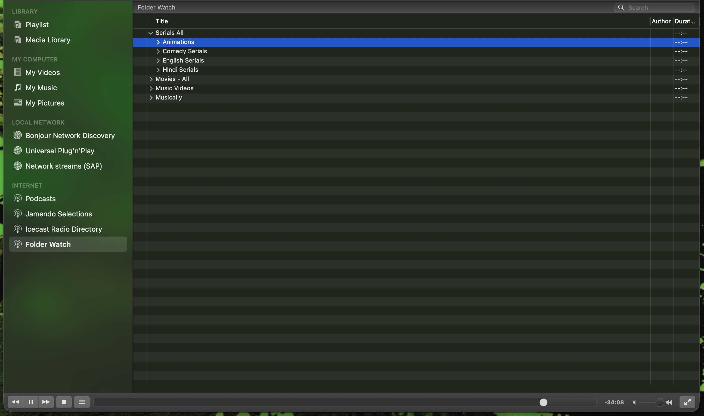

# Folder Watch for VLC

Your media folders as a tree in VLC's sidebar, kept fresh. Delete, add,
rename or replace files on disk and the tree follows within seconds, for as
long as VLC is open. No more dragging folders into the Media Library after
every change.



## Features

- A **Folder Watch** entry in VLC's sidebar showing the folders you choose as a
  tree: root folders, subfolders, files. Double-click to play, as always.
- Rescans every 15 seconds (adjustable) and rebuilds the tree whenever anything
  changed: files or folders deleted, added, renamed or replaced.
- Never interrupts playback: while anything from a watched folder is playing or
  paused, the rebuild waits until playback stops or moves elsewhere.
- A folder whose drive is unmounted is left exactly as it was, never emptied.
  When the drive is back, the tree refills.
- Settings panel under **View › Folder Watch for VLC**: choose folders with the
  normal macOS folder dialog, set the interval, force a rescan, see status.
- Plain-text settings file, editable by hand, picked up without restarting VLC.
- Hidden files and VLC's own ignored file types (subtitles, artwork, text) are
  not shown.

## Requirements

- macOS (tested on macOS 26 with an Apple silicon Mac)
- VLC 3.0 or newer, installed at `/Applications/VLC.app` (tested with 3.0.23)

VLC 4, once released, has its own media library that watches folders; Folder
Watch is for the VLC 3 that everyone runs today. Windows and Linux are planned
for a later release.

## Installation and setup

1. Download `folder-watch-for-vlc-1.0.0.zip` from the
   [latest release](https://github.com/ACEGlobal-Pro/folder-watch-for-vlc/releases/latest)
   and unzip it.
2. Quit VLC.
3. In Terminal:

   ```bash
   cd ~/Downloads/folder-watch-for-vlc-1.0.0
   ./install.sh --configure
   ```

4. Start VLC. The sidebar now has **Folder Watch** under Internet.
5. Open **View › Folder Watch for VLC**. The folder dialog opens on first run;
   choose the folder that holds your videos or music. The tree appears within
   seconds. Add more folders the same way.

What `--configure` does: it copies three Lua scripts into VLC's user folder and
switches on VLC's Lua interface, which is what lets the watcher run in the
background. If you prefer to do the second part by hand: Preferences › Show All
› Interface › Main interfaces › tick **Lua interpreter**; then Main interfaces
› Lua › *Lua interface* = `folderwatch`. Save and restart VLC.

## How it works

Three Lua scripts that VLC loads from
`~/Library/Application Support/org.videolan.vlc/lua/`:

| Script | Role |
|---|---|
| `sd/folderwatch.lua` | The sidebar entry. Builds the folder tree each time it is loaded. |
| `intf/folderwatch.lua` | The watcher. Runs while VLC is open, rescans on the interval, reloads the sidebar entry when something changed. |
| `extensions/folderwatch.lua` | The settings panel in the View menu. |

Settings live in `~/Library/Application Support/org.videolan.vlc/folderwatch.conf`:

```
interval=15
root=/Volumes/Media/Series
root=/Volumes/Media/Movies
ignore=srt,sub,txt      # optional; default is VLC's own ignore list plus .DS_Store
```

| On disk | In the sidebar |
|---|---|
| File deleted or renamed | Gone from the tree within one interval |
| File added | Appears in the tree |
| File replaced (size or date changed) | Re-read, so VLC picks up fresh metadata |
| Folder added, deleted or renamed | Same |
| Drive unmounted | That part of the tree is left as it was |
| Something from a watched folder is playing | The rebuild waits until playback stops |

One honest limit: a rebuild collapses the folders you had expanded in the
sidebar. VLC 3's add-on API cannot edit a sidebar tree row by row, so this is
the price of freshness.

## Permissions

Folder Watch needs no special permissions. It reads only the folders you
choose, using VLC's own file access. The folder chooser in the settings panel
is the standard macOS dialog, opened through a short AppleScript; macOS may ask
once whether VLC may control the dialog. Nothing is sent anywhere: there is no
network access of any kind.

## Troubleshooting

- **No "Folder Watch" in the sidebar.** The scripts are not where VLC looks.
  Rerun `./install.sh` and check that
  `~/Library/Application Support/org.videolan.vlc/lua/sd/folderwatch.lua` exists,
  then restart VLC.
- **The entry is there but the tree does not update.** The watcher is not
  running. The settings panel says "Watcher: not running yet" in that case. Quit
  VLC, run `./install.sh --configure`, start VLC again.
- **"Rebuild pending" in the panel.** Something from a watched folder is playing
  or paused. The tree updates as soon as playback stops.
- **A folder shows nothing.** Its drive is not mounted, or the folder holds only
  file types VLC ignores. Mount the drive; the tree refills on the next scan.
- **The tree collapsed.** A change on disk triggered a rebuild. Expand again.
- **Choose folder does nothing.** Type the full path into the field next to it
  and click **Add path**.

## Uninstall

```bash
./install.sh --uninstall
```

This removes the three scripts. Your settings file stays; delete
`~/Library/Application Support/org.videolan.vlc/folderwatch.conf` if you want it
gone. To switch VLC's Lua interface off again: Preferences › Show All ›
Interface › Main interfaces › untick **Lua interpreter**.

## Privacy

Everything runs inside VLC on your Mac. Folder Watch reads the folders you
choose and writes three small files next to VLC's own settings (settings,
status, a rescan trigger). It makes no network connections, collects nothing,
and phones home to no one.

## Issues and feedback

Bugs, questions and ideas:
[GitHub issues](https://github.com/ACEGlobal-Pro/folder-watch-for-vlc/issues).

## Licence

MIT. See [LICENSE](LICENSE).

## Development

```bash
./test/run-headless.sh
```

Runs the real VLC binary with no window against a throwaway folder and checks
every behaviour above, plus the settings panel's logic through a stub dialog.

Created by ACE Global Pro.
